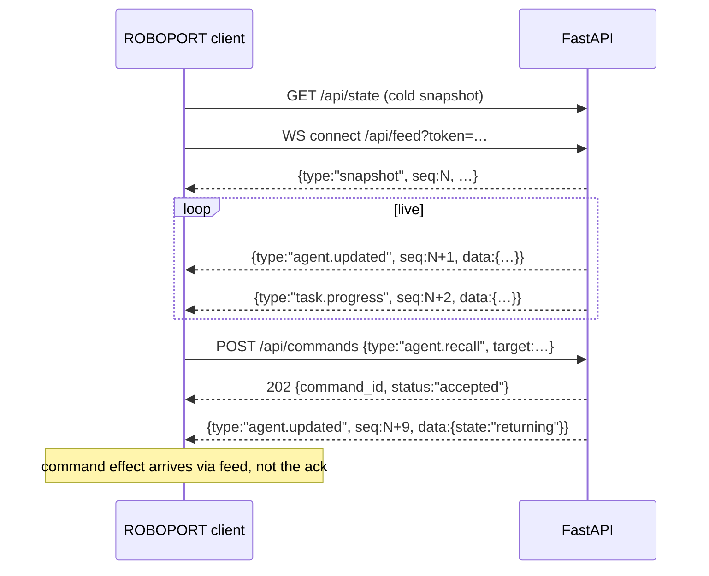

# ROBOPORT — Data Contract

The wire protocol between the ROBOPORT control surface (client) and the agent
runtime (FastAPI / SQLAlchemy backend). This is what replaces the client-side
simulation in `update()`.

---

## 1. Design principles

1. **Backend owns truth, client owns motion.** The server emits *logical* state
   — `state`, `task_progress`, `energy`, assignments. The client computes all
   positions, bezier paths, trails, and sparks. **The wire never carries x/y.**
   A drone's flight is animation; the server only says *what* it's doing, never *where on screen*.
2. **Snapshot + event deltas.** On connect the client gets one full `snapshot`,
   then granular events. `GET /api/state` returns the same snapshot for cold
   loads and polling fallback.
3. **Monotonic `seq` + per-entity `rev`.** Every feed message carries a global
   `seq`; every entity carries a `rev`. A `seq` gap → client re-syncs via
   snapshot. A stale `rev` → client drops the update. This makes reconnects and
   multi-operator concurrency safe.
4. **Commands are intents, not state writes.** The client POSTs a command; the
   server validates, mutates the runtime, and the resulting change comes back
   **through the feed** — not in the command response. The response is only an
   ack. One source of truth for state.
5. **Stable string IDs.** `agent_id` (`"drone-01"`), `station_id`
   (`"stn.snowflake"`), `task_id` (uuid). Never positional indices on the wire.
6. **Units.** Time = ISO-8601 UTC (`...Z`). Energy `0–100`. Progress `0–1`.
   Durations in seconds (float).

---

## 2. Data flow

```
                 ┌──────────────────── FastAPI ────────────────────┐
                 │                                                  │
  operator       │   command bus            runtime          feed  │
  ───────────►  POST /api/commands ──► validate ──► mutate ──► WS broadcast
  (UI buttons)   │        │ack(202)                  │              │
                 │        ▼                          ▼              │
                 │   audit log (SQLAlchemy)    agents / tasks       │
                 │                             stations / alerts    │
                 └───────────────────────────────────┬─────────────┘
                                                      │  ws://…/feed
  ROBOPORT  ◄───── snapshot ───────────────┐         │  (seq-ordered
  client    ◄───── agent.updated ──────────┤◄────────┘   events)
            ◄───── task.enqueued ──────────┤
            ◄───── alert.raised ───────────┘
            └─ animates positions toward logical state, renders rings/queue/toasts
```

Connect + command lifecycle:



---

## 3. Transport

| Purpose | Channel | Notes |
|---|---|---|
| Live state feed | `WS /api/feed` | seq-ordered envelopes; primary path |
| Cold snapshot / poll fallback | `GET /api/state` | identical body to the `snapshot` event |
| Operator commands | `POST /api/commands` | unified command bus (see §7) |
| Heartbeat | WS ping every 15s | no message in 30s → client reconnects |

Auth: bearer token (your Entra ID access token) on the WS connect as
`?token=` or `Sec-WebSocket-Protocol`, and `Authorization: Bearer` on REST.

---

## 4. Feed envelope

Every WebSocket message:

```json
{
  "v": 1,
  "seq": 1042,
  "ts": "2026-06-21T18:30:04.512Z",
  "type": "agent.updated",
  "data": { }
}
```

**Event types**

| Type | `data` payload | Client effect |
|---|---|---|
| `snapshot` | full state (§6) | rebuild everything |
| `agent.added` / `agent.updated` / `agent.removed` | Agent / Agent / `{agent_id}` | roster + drone |
| `task.enqueued` / `task.assigned` / `task.progress` / `task.completed` / `task.failed` / `task.cancelled` | Task | queue strip, station badge, WORK ring |
| `station.updated` | Station | pad state, drain slash, badge |
| `alert.raised` / `alert.cleared` | Alert / `{alert_id}` | toast in/out |
| `metrics.tick` | Metrics (≈1 Hz) | HUD stats |
| `log.appended` | LogLine | activity pane |

A consumer that only reads `snapshot` + `*.updated` + `metrics.tick` already
renders a correct surface; the finer events exist for animation fidelity and
the activity log.

---

## 5. Entity schemas

### Agent

```json
{
  "agent_id": "drone-01",
  "name": "drone-01",
  "state": "working",
  "energy": 64.2,
  "hold": false,
  "task_id": "t_8f2a",
  "station_id": "stn.snowflake",
  "task_progress": 0.41,
  "eta_s": null,
  "completed_total": 37,
  "error": null,
  "rev": 91,
  "updated_at": "2026-06-21T18:30:04.512Z"
}
```

`state ∈ { docked, dispatched, working, returning, offline }`. `hold` is
orthogonal to `state` (a held agent is `docked` + `hold:true`). `task_progress`
is meaningful only while `working`. "Low cell" is **derived client-side**
(`energy < 22 && state != docked`) — not a server state.

### Station

```json
{
  "station_id": "stn.snowflake",
  "name": "Snowflake",
  "order": 1,
  "state": "busy",
  "worker_agent_id": "drone-01",
  "queue_depth": 3,
  "drain": false,
  "rev": 44
}
```

`hue` is static config, not live state — delivered once in `snapshot.config`.

### Task

```json
{
  "task_id": "t_8f2a",
  "station_id": "stn.snowflake",
  "status": "running",
  "priority": 100,
  "work_estimate_s": 3.6,
  "assigned_agent_id": "drone-01",
  "enqueued_at": "2026-06-21T18:29:58.004Z",
  "started_at": "2026-06-21T18:30:02.114Z",
  "finished_at": null,
  "result": null,
  "error": null,
  "rev": 12
}
```

`status ∈ { queued, assigned, running, completed, failed, cancelled }`. The
**queue** = tasks with `status == queued`, ordered by `(priority asc, enqueued_at asc)`.
Lower priority number = closer to the front.

### Alert

```json
{
  "alert_id": "al_5c1",
  "kind": "critical",
  "title": "drone-03 low cell",
  "body": "Aborted trip at 14% — returning to charge.",
  "target": { "type": "agent", "id": "drone-03" },
  "raised_at": "2026-06-21T18:30:01.880Z",
  "ttl_s": 5
}
```

`kind ∈ { info, warning, critical }` → toast `info | warn | bad`.
`target.type ∈ { agent, station, port }` so clicking the toast selects the entity.

### Metrics

```json
{
  "tasks_per_min": 11,
  "completed_total": 482,
  "active_agents": 4,
  "total_agents": 6,
  "queued": 5,
  "uptime_s": 3640,
  "ts": "2026-06-21T18:30:04.000Z"
}
```

### Pydantic (v2) — server side

```python
from __future__ import annotations
from datetime import datetime
from enum import Enum
from typing import Literal, Optional
from pydantic import BaseModel, Field

class AgentState(str, Enum):
    docked = "docked"; dispatched = "dispatched"; working = "working"
    returning = "returning"; offline = "offline"

class TaskStatus(str, Enum):
    queued = "queued"; assigned = "assigned"; running = "running"
    completed = "completed"; failed = "failed"; cancelled = "cancelled"

class Agent(BaseModel):
    agent_id: str
    name: str
    state: AgentState
    energy: float = Field(ge=0, le=100)
    hold: bool = False
    task_id: Optional[str] = None
    station_id: Optional[str] = None
    task_progress: float = Field(0, ge=0, le=1)
    eta_s: Optional[float] = None
    completed_total: int = 0
    error: Optional[str] = None
    rev: int
    updated_at: datetime

class Station(BaseModel):
    station_id: str
    name: str
    order: int
    state: Literal["idle", "busy", "draining"]
    worker_agent_id: Optional[str] = None
    queue_depth: int = 0
    drain: bool = False
    rev: int

class Task(BaseModel):
    task_id: str
    station_id: str
    status: TaskStatus
    priority: int = 100
    work_estimate_s: float
    assigned_agent_id: Optional[str] = None
    enqueued_at: datetime
    started_at: Optional[datetime] = None
    finished_at: Optional[datetime] = None
    result: Optional[dict] = None
    error: Optional[str] = None
    rev: int

class AlertTarget(BaseModel):
    type: Literal["agent", "station", "port"]
    id: Optional[str] = None

class Alert(BaseModel):
    alert_id: str
    kind: Literal["info", "warning", "critical"]
    title: str
    body: str
    target: Optional[AlertTarget] = None
    raised_at: datetime
    ttl_s: Optional[float] = None

class Metrics(BaseModel):
    tasks_per_min: int
    completed_total: int
    active_agents: int
    total_agents: int
    queued: int
    uptime_s: int
    ts: datetime

class StationConfig(BaseModel):
    station_id: str
    name: str
    order: int
    hue: str   # e.g. "#36c6e0"

class Envelope(BaseModel):
    v: int = 1
    seq: int
    ts: datetime
    type: str
    data: dict
```

---

## 6. Snapshot

```json
{
  "v": 1,
  "seq": 1042,
  "ts": "2026-06-21T18:30:04.512Z",
  "type": "snapshot",
  "data": {
    "config": {
      "stations": [
        { "station_id": "stn.ingest",     "name": "Ingest",     "order": 0, "hue": "#7ea6ff" },
        { "station_id": "stn.snowflake",  "name": "Snowflake",  "order": 1, "hue": "#36c6e0" },
        { "station_id": "stn.decrypt",    "name": "Decrypt",    "order": 2, "hue": "#c98bff" },
        { "station_id": "stn.rag",        "name": "RAG",        "order": 3, "hue": "#4fd672" },
        { "station_id": "stn.synthesize", "name": "Synthesize", "order": 4, "hue": "#f2b134" },
        { "station_id": "stn.validate",   "name": "Validate",   "order": 5, "hue": "#ff8f6b" },
        { "station_id": "stn.publish",    "name": "Publish",    "order": 6, "hue": "#ff5a8a" }
      ],
      "energy_low_threshold": 22,
      "max_agents": 12
    },
    "agents":   [ /* Agent[] */ ],
    "stations": [ /* Station[] */ ],
    "tasks":    [ /* Task[] (queued + active) */ ],
    "alerts":   [ /* Alert[] */ ],
    "metrics":  { /* Metrics */ }
  }
}
```

`GET /api/state` returns this `data` body directly (with `seq` in a header or
wrapped identically — pick one and keep it consistent).

---

## 7. Commands

One endpoint, idempotent, audit-friendly — the right shape for a control plane.

```
POST /api/commands
{
  "command_id": "c_3b91",          // client-generated uuid → idempotency key
  "type": "agent.recall",
  "target": { "type": "agent", "id": "drone-01" },
  "args": {},
  "issued_by": "operator",
  "ts": "2026-06-21T18:30:05.000Z"
}

202 → { "command_id": "c_3b91", "status": "accepted" }
409 → { "command_id": "c_3b91", "status": "rejected", "reason": "agent already docked" }
422 → { "command_id": "c_3b91", "status": "rejected", "reason": "unknown agent" }
```

The state change is **not** in the response — it arrives on the feed as the
relevant `*.updated` / `task.*` event(s).

### Command catalog (maps 1:1 to the UI controls)

| UI control | `type` | `target` | `args` |
|---|---|---|---|
| Agent → Recall | `agent.recall` | agent | — |
| Agent → Hold / Resume | `agent.hold` | agent | `{ "hold": true\|false }` |
| Agent → Retire | `agent.retire` | agent | — |
| Dock → + Agent | `fleet.spawn_agent` | port | `{ "name"?: str }` |
| Station → Queue task / dock injector | `task.enqueue` | station | `{ "priority"?: int, "work_estimate_s"?: float, "payload"?: {} }` |
| Station → Prioritize | `station.prioritize` | station | — |
| Station → Drain / Open | `station.drain` | station | `{ "drain": true\|false }` |
| Hub → Hold all / Resume all | `fleet.hold` | port | `{ "hold": true\|false }` |
| Hub → Recall all | `fleet.recall` | port | — |
| Hub → Clear queue | `queue.clear` | port | — |

```python
class Command(BaseModel):
    command_id: str
    type: str
    target: AlertTarget          # reuse: {type, id}
    args: dict = {}
    issued_by: str = "operator"
    ts: datetime

class CommandAck(BaseModel):
    command_id: str
    status: Literal["accepted", "rejected"]
    reason: Optional[str] = None
```

> REST sugar is fine too (`POST /api/agents/{id}/recall`) if you prefer — but the
> unified bus gives you idempotency keys and a single audit table for free,
> which matters once two operators (or an autonomous policy) issue commands.

---

## 8. Feed field → UI mapping

| Feed field | Renders as |
|---|---|
| `agent.state` | drone visual state + roster `act` label (see map below) |
| `agent.energy` | selection energy ring, roster bar, `↺ x%` tag |
| `agent.hold` | `⏸` lock, dimmed drone, Hold/Resume button toggle |
| `agent.task_progress` | WORK `⚙ %` tag + station pulse |
| `task.status == queued` | queue strip chip + station badge count |
| `task.station_id` | chip color + which station pulses |
| `station.drain` | red slash on pad, "drained" in inspector |
| `station.worker_agent_id` | inspector "worker" field |
| `alert.*` | toast (`kind`→`info/warn/bad`), `target`→click-to-select |
| `metrics.*` | HUD stats row |

**State map** (server → client render state):

| server `state` | client render | tag |
|---|---|---|
| `docked` + `hold` | DOCK | `⏸ hold` |
| `docked`, energy<100 | DOCK | `↺ x%` |
| `docked`, energy=100 | DOCK | `● ready` |
| `dispatched` | DISPATCH | `→ <station>` |
| `working` | WORK | `⚙ <task_progress>%` |
| `returning` | RETURN | `✓ result` / `⚠ low cell` if energy<22 |
| `offline` | remove drone / grey roster row | — |

---

## 9. Client adapter (replaces the internal sim)

The artifact's `update(dt)` stops generating tasks and flipping states. It keeps
only **animation** — lerping each drone toward the logical target implied by its
feed state — and applies events into the local model.

```js
// ---- feed ingest ----
let lastSeq = 0;
function connect(){
  const ws = new WebSocket(`wss://roboport.local/api/feed?token=${TOKEN}`);
  ws.onmessage = (e)=>{
    const m = JSON.parse(e.data);
    if (m.type !== "snapshot" && m.seq !== lastSeq + 1) return resync(); // gap
    lastSeq = m.seq;
    apply(m);
  };
  ws.onclose = ()=> setTimeout(connect, backoff());   // exp backoff + reconnect→snapshot
}

function apply(m){
  switch(m.type){
    case "snapshot":    hydrate(m.data); lastSeq = m.seq; break;
    case "agent.updated": upsert(model.agents, m.data); break;  // honor rev
    case "agent.removed": model.agents.delete(m.data.agent_id); break;
    case "task.enqueued":
    case "task.assigned":
    case "task.progress":
    case "task.completed": upsertTask(m.data); break;
    case "station.updated": upsert(model.stations, m.data); break;
    case "alert.raised":  pushToast(m.data); break;
    case "metrics.tick":  model.metrics = m.data; break;
  }
}
function upsert(map, e){                 // drop stale revisions
  const cur = map.get(e.agent_id ?? e.station_id);
  if (cur && cur.rev > e.rev) return;
  map.set(e.agent_id ?? e.station_id, e);
}

// ---- animation only ----
function update(dt){
  for (const a of model.agents.values()){
    const target = targetFor(a);         // station xy if dispatched/working, hub xy if docked/returning
    a.x += (target.x - a.x) * Math.min(1, dt*4);   // or drive the bezier by task_progress / eta_s
    a.y += (target.y - a.y) * Math.min(1, dt*4);
    a.ring = a.task_progress;             // WORK ring straight from feed
  }
}

// ---- commands ----
async function command(type, target, args={}){
  const command_id = crypto.randomUUID();
  await fetch("/api/commands", {
    method:"POST",
    headers:{ "Content-Type":"application/json", "Authorization":`Bearer ${TOKEN}` },
    body: JSON.stringify({ command_id, type, target, args, issued_by:"operator", ts:new Date().toISOString() })
  });
  // no optimistic mutation — the feed delivers the state change
}
// e.g. Recall button → command("agent.recall", {type:"agent", id:selected.id})
```

The existing render layer (drones, selection rings, queue strip, toasts,
inspector) is unchanged — it's already reading a model; you're just swapping the
model's *source* from the internal sim to the feed.

---

## 10. Resync, versioning, reconnect

- **seq gap** (`m.seq !== lastSeq + 1`) → `GET /api/state`, rehydrate, resume.
- **stale rev** (`incoming.rev <= current.rev`) → drop the message.
- **reconnect** → exponential backoff (cap ~10s); on open, always snapshot first.
- **heartbeat** → server ping every 15s; client treats 30s silence as dead → reconnect.
- **multi-operator** → command bus + per-entity `rev` give last-write-wins;
  the audit table (`command_id`, `issued_by`, `ts`, result) is the record of who did what.

---

## 11. Decisions to lock before building

1. **Auth** — Entra bearer token on WS + REST? Confirm token placement
   (subprotocol vs query param) and refresh handling on long-lived sockets.
2. **Positions** — staying client-animated (recommended), or does a real spatial
   map ever drive `x/y`? If the latter, add an optional `pose` block to Agent.
3. **Task payloads** — what goes in `task.payload` / `task.result`? Define the
   per-station schema (e.g. Decrypt expects `{file_id}`, returns `{pages}`).
4. **History depth** — snapshot carries active + queued tasks only; completed
   tasks via a separate `GET /api/tasks?status=completed&limit=` for the log.
5. **Backpressure** — cap `metrics.tick` at 1 Hz and coalesce rapid
   `task.progress` to ~5 Hz so the feed stays cheap under a large fleet.
