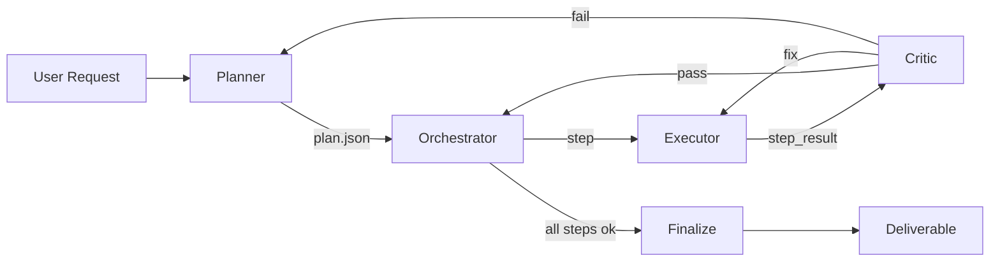

# Workflow: Agent Execution Flow

How a single user request becomes a finished deliverable. This is the spine of every ROBOPORT run.



---

## Stage-by-stage

### Stage 1 — Plan

The Planner reads `goal`, `context`, `constraints`, and `agent_registry`. It emits `plan.json` with a deliverable, ordered steps (with `wave` numbers for parallelism), success criteria per step, and a fallback for the whole plan.

**Out of plan, into log.** The plan goes to `runs/<run_id>/plan.json` before any step runs. Plans are auditable artifacts, not ephemeral.

### Stage 2 — Dispatch

The Orchestrator walks the plan wave-by-wave. Within a wave, steps run in parallel. Between waves, output from earlier steps threads forward via `accumulated_outputs[step_id]`.

The Orchestrator does not interpret outputs — it carries them. Interpretation is the next agent's job.

### Stage 3 — Execute

The Executor takes one step. It:

1. Validates inputs against `step.input_schema`
2. Picks the cheapest tool that can answer
3. Calls the tool (with retries per `tool_usage.md`)
4. Self-verifies success criteria (must quote evidence per criterion)
5. Returns `{status, output, criteria_results, transcript_path}`

Steps marked `deterministic: true` skip the LLM entirely — they're plain code.

### Stage 4 — Critique

If `status == failed` with `type: criterion_failed`, the Orchestrator calls the Critic. The Critic returns `pass | fix | fail`:

- `pass` — Orchestrator overrides the Executor's failure (rare; usually means the criterion was wrong)
- `fix` — Orchestrator re-runs the Executor *once*, with the Critic's `suggested_repair` injected as a hint
- `fail` — Orchestrator escalates to the Planner for re-plan, or aborts

The fix loop runs at most once per step. Two failures in a row → re-plan or abort.

### Stage 5 — Finalize

When the last step's output matches the plan's `deliverable`, the Orchestrator:

1. Writes `final_output.json`
2. Writes `run_summary.json` with counts (steps, retries, llm_calls, tool_calls, wall-time)
3. Returns to the user

If any *blocker* step failed and could not be repaired, the run finalizes with `status: failed` and a structured surface to the user — never a silent partial.

---

## Concrete example: JD-Crew run

```
Wave 0: planner emits plan {scout → (technical, compliance) → strategist → synthesizer}
Wave 1: job_scout         (1 LLM call,  3 tool calls)
Wave 2: technical_analyst, compliance_risk      (parallel; 1 LLM call each)
Wave 3: application_strategist                  (1 LLM call)
Wave 4: synthesizer       (deterministic; 0 LLM calls)
Final:  FinalReport.json + warnings[]
```

That matches the flow stats from the Crew Builder UI: **llm_calls: 4, deterministic: 2** (synthesizer + the two-source dedupe inside scout), **tools_attached: 10**.

---

## Multi-turn variant (AutoGen-style conversation)

For tasks that need back-and-forth (e.g., the user clarifies after seeing intermediate output), the Orchestrator can pause after Wave N and surface the partial state:

```
Wave 1: scout returns 3 jobs
[PAUSE — user reviews and excludes one company]
Wave 2: technical + compliance run on the remaining 2 jobs
...
```

The pause is an explicit step in the plan (`owner: user`, `kind: review`), not a hack. The Orchestrator persists state to disk and resumes when the user replies.

---

## Observability

Every stage emits structured events to `runs/<run_id>/run.log` (JSONL). Useful queries:

```bash
# Which step took longest?
jq -s 'group_by(.step_id) | map({step: .[0].step_id, ms: ([.[].duration_ms] | add)})' runs/<run_id>/run.log

# How many retries per step?
jq -s 'map(select(.event=="retry")) | group_by(.step_id) | map({step: .[0].step_id, retries: length})' runs/<run_id>/run.log
```

`scripts/aggregate.py` ships with these as named queries.
