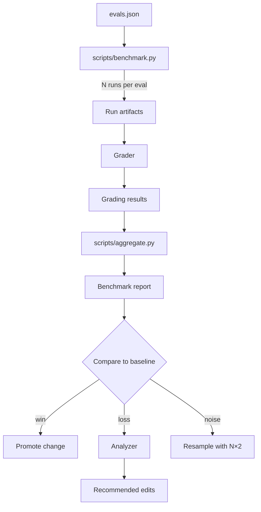

# Workflow: Evaluation Pipeline

How ROBOPORT measures whether changes are improvements, regressions, or noise.



---

## Phase 1 — Benchmark

```bash
python scripts/benchmark.py \
  --target jd_crew \
  --eval-set evals/evals.json \
  --runs 3 \
  --out evals/benchmarks/$(date +%Y-%m-%d)-pre-change
```

Three runs per eval is the floor. For tighter signals on small differences, use 5 or 10. Costs scale linearly — budget accordingly.

The benchmark writes:

```
evals/benchmarks/<date>-<label>/
├── summary.json        # rolled-up pass rates per eval
├── eval_1/
│   ├── run_1/
│   │   ├── plan.json
│   │   ├── final_output.json
│   │   └── run.log
│   ├── run_2/
│   └── run_3/
└── ...
```

## Phase 2 — Grade

```bash
python scripts/aggregate.py \
  --grade \
  --benchmark evals/benchmarks/<date>-<label>
```

For each run, the Grader produces a `GradingResult` (per `resources/schemas/grading.schema.json`). The aggregator rolls these into:

- **Per-eval pass rate** (across N runs)
- **Per-expectation pass rate** (across all evals × runs)
- **Blocker failure rate** (any blocker failed counts the whole run as failed)
- **Meta-critiques** (every Grader's `meta_critique` collated and deduped)

The meta-critiques section is what makes the eval set itself improve over time. Read it.

## Phase 3 — Compare

To decide whether a change is a real improvement:

```bash
python scripts/aggregate.py \
  --compare \
  --baseline evals/benchmarks/<date>-pre-change \
  --candidate evals/benchmarks/<date>-post-change
```

The comparator (using `agents/evaluation/comparator.md` as its spec) outputs:

```json
{
  "criteria": [
    {"name": "blocker_pass_rate", "winner": "candidate", "baseline": 0.91, "candidate": 0.97, "blocker": true},
    {"name": "overall_pass_rate", "winner": "candidate", "baseline": 0.83, "candidate": 0.88, "blocker": false},
    {"name": "llm_calls_per_run", "winner": "baseline",  "baseline": 4.0,  "candidate": 4.7,  "blocker": false}
  ],
  "verdict": "candidate wins on blocker quality, regresses on cost. Decide if cost regression is acceptable."
}
```

## Phase 4 — Decide

| Verdict | Action |
|---|---|
| Candidate wins on blockers, doesn't lose on any blocker | **Promote**: merge the change, update the baseline pointer |
| Candidate ties or loses on blockers | **Analyzer**: produce a diagnosis + recommended edits |
| Differences are within noise margin (rule of thumb: <2σ on N=3 runs) | **Resample**: rerun with N×2 |

The "noise" case is real and common. Don't merge changes that the data can't distinguish from variance — that's how you accumulate cruft that nobody understands.

---

## Tracking the eval set itself

The eval set is a *living artifact*. Every release should:

1. Audit the meta-critiques from the latest benchmark
2. Strengthen weak expectations (the Grader will tell you which)
3. Add new expectations for failure modes seen in production
4. Retire expectations that have been green for ≥10 consecutive benchmarks (they're not exercising anything)

Run `python scripts/validate.py --evals evals/evals.json` before committing to ensure the schema stays valid.

---

## Trigger optimization (separate, optional pass)

Once an agent works, optimize *when* it gets called. The Planner reads agent descriptions to decide ownership; weak descriptions cause under-triggering even on good agents.

```bash
python scripts/benchmark.py \
  --mode trigger-optimize \
  --target <agent_id> \
  --max-iterations 5
```

This runs a separate loop: split the trigger-eval set 60/40, propose description variants, score on held-out, pick the winner by held-out score (not train, to avoid overfitting). Output: a `best_description` field. Apply it to the registry, commit.
