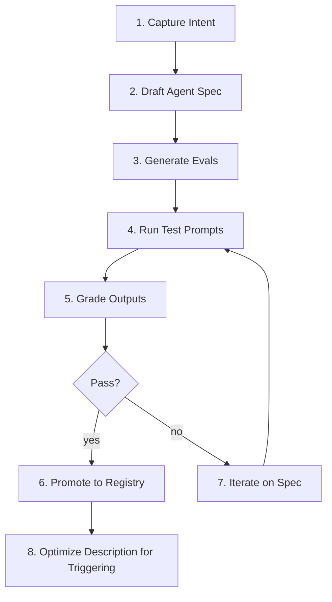

# Workflow: Skill Creation Flow

The loop ROBOPORT uses to add a new agent or crew to the registry. Adapted from the skill-creator pattern, generalized for ROBOPORT.



---

## 1. Capture Intent

Before writing anything: answer four questions in writing.

1. **What does this agent enable the system to do** that it can't already?
2. **When should it trigger** — what user phrases or upstream outputs?
3. **What's the expected output shape** (link to a schema definition)?
4. **Are the outputs objectively verifiable** (file transforms, structured data) or subjective (writing, design)?

If a similar agent already exists, *modify it* instead of adding a new one. The registry is not a junk drawer.

---

## 2. Draft Agent Spec

Create `agents/<role>/<id>.md` with the standard YAML frontmatter:

```yaml
---
id: <snake_case>
role: core | evaluation | domain | domain.<crew>
inputs: ...
outputs: ...
model_hint: reasoning-strong | tool-use-capable | writing-strong | none
temperature: 0.0–1.0
deterministic: true | false
---
```

Body sections (in order): **Role**, **Inputs**, **Process** (or **Capabilities**), **Output**, **Success criteria**, **Anti-patterns**, **Hand-off**.

Add the agent to `agents/registry.json` *only after* eval passes, not now. Keep the registry clean.

---

## 3. Generate Evals

Author `evals/evals.json` (or amend the existing file) per the eval schema. Minimum 4 evals per new agent:

- 1 happy-path
- 1 edge case (empty input, malformed input, or zero-result)
- 1 anti-hallucination test (asks for something the agent should *not* do)
- 1 contract test (verifies output shape conforms to schema)

Mark blockers explicitly. A run with a passed-rate of 0.9 but a failed blocker is a **failed** run.

---

## 4. Run Test Prompts

```bash
python scripts/benchmark.py --target <agent_id> --eval-set evals/evals.json --runs 3
```

Three runs per eval is the minimum to distinguish a bug from a roll of the dice. The benchmark script writes runs under `runs/<run_id>/` and aggregates with `scripts/aggregate.py`.

---

## 5. Grade Outputs

For each run, the Grader produces a `GradingResult` per `resources/schemas/grading.schema.json`. Store at `runs/<run_id>/grading.json`.

Read the **`meta_critique`** every time. The Grader will tell you when your evals are weak; ignore it and you'll ship false confidence.

---

## 6. Promote to Registry

Only after:

- All blocker expectations pass on all 3 runs
- Pass rate ≥ 0.85 on non-blocker expectations
- A human has read at least 2 of the run transcripts and signed off

…add the agent to `agents/registry.json` and link it into the relevant crew's `edges`.

---

## 7. Iterate on Spec

When evals fail, the fix is almost always in **one** of these three places, in this order:

1. **The success criteria** were wrong (the agent is doing the right thing; the test was wrong)
2. **The agent prompt** was ambiguous (clarify input/output sections; add an anti-pattern)
3. **The plan** was wrong (the agent is being given an impossible step)

Don't reach for #2 (prompt edits) until you've ruled out #1.

---

## 8. Optimize Description for Triggering

After the agent works, separately optimize the **description** in the registry — that's what the Planner reads when deciding which agent owns a step. A weak description means the agent never gets called even when it should.

Run `scripts/benchmark.py --mode trigger-optimize --target <agent_id>` to A/B test description variants.

---

## Quick reference: where things live

| Artifact | Path |
|---|---|
| Agent spec | `agents/<role>/<id>.md` |
| Registry entry | `agents/registry.json` |
| Eval set | `evals/evals.json` |
| Run artifacts | `runs/<run_id>/` |
| Grading | `runs/<run_id>/grading.json` |
| Aggregated benchmarks | `evals/benchmarks/` |
